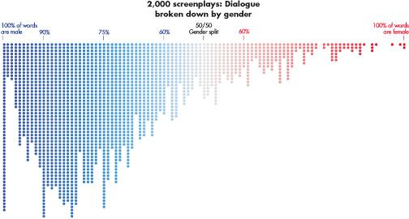

# 2,000 Screenplays: Dialogue Broken Down By Gender
## By: June Mi Hong 🐵

*01/11/2023*

## Data Viz Summary

This graph provides a visual representation of the disparity when it comes to line distribution between genders in cinema. Men speak more often than women in the majority of films- about 15% of the movies in this study had men speak over 90% of the lines, and about 60% of the films in this study had men speak in between 60-90% of the lines. In all genres recorded, men spoke the majority of the lines. In all decades recorded, men spoke the majority of the lines. This disparity reflects the power difference not only within Hollywood but also within most discussions in real life- whether it be within homes, social outings, or workplaces: these conversations are more often than not dominated by men. What this graph does is it provides the public with real hard, undeniable data, which can help lead to informed discussion and change in the future.

“Data feminism requires us to challenge the gender binary, along with other systems of counting and classification that perpetuate oppression.” (D’Ignazio, 2020)

Link to article: [The Pudding](https://pudding.cool/2017/03/film-dialogue/).

## Data Viz Biography

1. **Who or what institution produced the visualization?**
The institution that produced this graph is called The Pudding, and they are a digital publication institution.
2. **When was it produced?**
This graphy was produced in April of 2016.
3. **Who is the audience for the visualization?**
This graph is likely for those interested in topics such as feminism and Hollywood films.
4. **How might the visualization be interpreted or misinterpreted? What consequences might this interpretation/misinterpretation have?**
This graph is not a complete representation of all screenplays, but rather has a focus on American Hollywood films and has slight room for error within the script analysis. This graph should not be treated as the absolute truth that perfectly represents all films, but rather just points out a general pattern within the film industry (particualarly in America).
5. **How, if at all, does the data visualization represent power or systems?**
This data visualization represents the power imbalance not only within Hollywood systems but within all conversations within our society. Whether it be at home, within the workplace, or within social situations, conversations are typically dominated by men, and women get less space to tell their stories, bring up their own ideas, and voice their opinions.